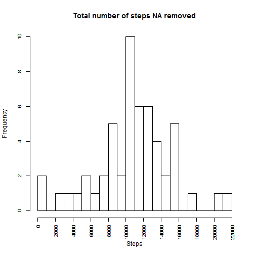
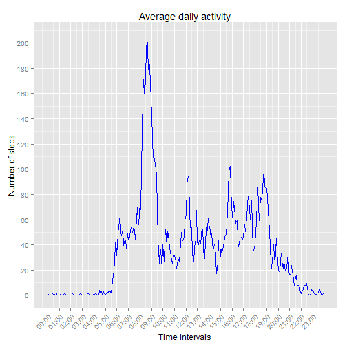
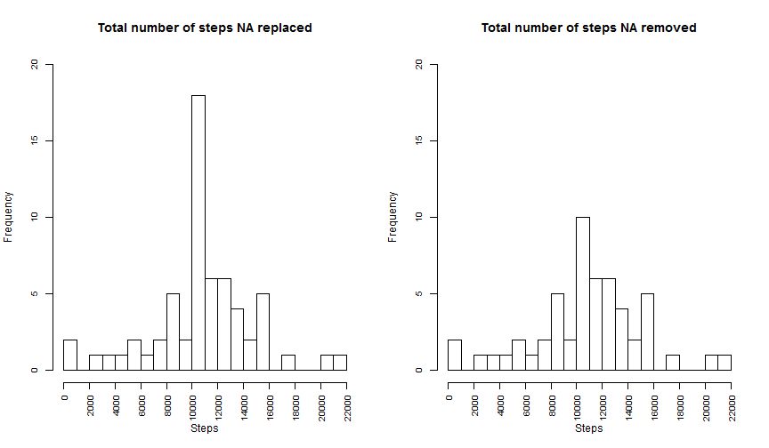
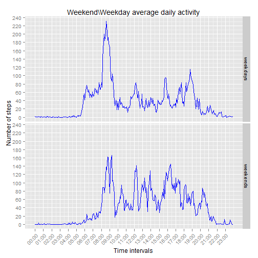

#Introduction
It is now possible to collect a large amount of data about personal movement using activity monitoring devices such as a Fitbit, Nike Fuelband, or Jawbone Up. These type of devices are part of the "quantified self" movement -- a group of enthusiasts who take measurements about themselves regularly to improve their health, to find patterns in their behavior, or because they are tech geeks. But these data remain under-utilized both because the raw data are hard to obtain and there is a lack of statistical methods and software for processing and interpreting the data.

In this assignment I'll try to make use of data from a personal activity monitoring device by answering a number of questions related to the data set. My goal is to understand what the average day of the person who took this meassurments. 


#Data description
The data was collected by the activity monitoring device at five minutes intervals through out the day. It consists of two months of data from an anonymous individual collected during the months of October and November, 2012 and include the number of steps taken in 5 minute intervals each day.

The data set is comma-separated-value (CSV) that was stored in "activity.csv" in the working directory. It has three variables (columns):

- steps: Number of steps taking in a 5-minute interval (missing values are coded as NA);
- date: The date on which the measurement was taken in YYYY-MM-DD format;
- interval: Identifier for the 5-minute interval in which measurement was taken.

The total number of observations(rows) is 17568.


The data was downloaded from https://d396qusza40orc.cloudfront.net/repdata%2Fdata%2Factivity.zip. Placed into the working directory and unzipped.


#Data loading and preprocessing


For the code in this .Rmd file to work properly, this are the needed external libraries: "xtable","dplyr","ggplot2","reshape2".

The code below will check if they are installed and if not it will download the required packages:


```r
        if("xtable" %in% rownames(installed.packages()) == FALSE) {
                install.packages("xtable")
        }

        if("dplyr" %in% rownames(installed.packages()) == FALSE) {
                install.packages("xtable")
        }

        if("ggplot2" %in% rownames(installed.packages()) == FALSE) {
                install.packages("ggplot2")
        }
        if("reshape2" %in% rownames(installed.packages()) == FALSE) {
                install.packages("reshape2")
        }
        if("knitr" %in% rownames(installed.packages()) == FALSE) {
                install.packages("knitr")
        }

        library(knitr)

        opts_chunk$set(echo = TRUE)

        library(xtable)
        library(ggplot2)
        library(reshape2)
        require(dplyr)
```


The columns of the data set are of types integer, factor and integer:


```r
        data<-read.csv("activity.csv",header=TRUE)
        str(data)
```

```
## 'data.frame':	17568 obs. of  3 variables:
##  $ steps   : int  NA NA NA NA NA NA NA NA NA NA ...
##  $ date    : Factor w/ 61 levels "2012-10-01","2012-10-02",..: 1 1 1 1 1 1 1 1 1 1 ...
##  $ interval: int  0 5 10 15 20 25 30 35 40 45 ...
```


The first and the last 6 rows of the dataset:

```r
      print(head(data))
```

```
##   steps       date interval
## 1    NA 2012-10-01        0
## 2    NA 2012-10-01        5
## 3    NA 2012-10-01       10
## 4    NA 2012-10-01       15
## 5    NA 2012-10-01       20
## 6    NA 2012-10-01       25
```

```r
      print(tail(data))
```

```
##       steps       date interval
## 17563    NA 2012-11-30     2330
## 17564    NA 2012-11-30     2335
## 17565    NA 2012-11-30     2340
## 17566    NA 2012-11-30     2345
## 17567    NA 2012-11-30     2350
## 17568    NA 2012-11-30     2355
```


The data was processed for the ease of use. First the date column containing a date af the measurment was converted from factor into a date type. 

```r
        data$date<-as.Date(data$date)
```


If closely examined, the "interval" column has a clear pattern for each day, starting from 0,5,10,15,20 ... up to 2355, which is obviously 0:00 (midnight) and 23:55 - five minutes before midnight. So the fourth column was introduced:

- TimeofDay


```r
         parseInterval<-function(interval){
                interval<-as.character(interval)
                if(nchar(interval) <= 2){                        
                        interval <- paste("00",interval,sep=":")
                }else if(nchar(interval) == 3){
                        intervalH <- substr(interval,1,1)
                        intervalM <- substr(interval,2,3)
                        interval <- paste(intervalH,intervalM,sep=":")
                }else{                        
                        intervalH <- substr(interval,1,2)
                        intervalM <- substr(interval,3,4)
                        interval <- paste(intervalH,intervalM,sep=":")
                }
                return(interval)
        }
        
        Time_Of_Day <- as.vector(sapply(data$interval,FUN=parseInterval))
        
        data$TimeofDay <- paste(data$date,Time_Of_Day)
        data$TimeofDay <- as.POSIXct(strptime(data$TimeofDay, "%Y-%m-%d %H:%M"))
        
        data$TimeofDay <- format(data$TimeofDay,"%H:%M")
```


After a series of manipulations the data set looks like this (first six rows):

```r
        print(head(data))
```

```
##   steps       date interval TimeofDay
## 1    NA 2012-10-01        0     00:00
## 2    NA 2012-10-01        5     00:05
## 3    NA 2012-10-01       10     00:10
## 4    NA 2012-10-01       15     00:15
## 5    NA 2012-10-01       20     00:20
## 6    NA 2012-10-01       25     00:25
```

#Analysis


```r
        NAs <- unique(data$date[is.na(data)]) 
```


If one takes a look at the dataset it will be clear that dates 2012-10-01, 2012-10-08, 2012-11-01, 2012-11-04, 2012-11-09, 2012-11-10, 2012-11-14, 2012-11-30 have no information of the number of steps taken. The "Total number of steps NA removed" plot below shows the total number of steps taken each day were NA values are removed.


```r
        par(cex.axis=0.8)

        plot.data<-data[!is.na(data$steps),]
        
        totalForDay<-plot.data%>%group_by(date)%>%summarise(total = sum(steps))

        meanforDay <- mean(totalForDay$total)

        hist(totalForDay$total,breaks=20, xlab = "Steps", main = "Total number of steps NA removed", xaxt='n')
        axis(side=1,at=seq(0,22000,by=2000),las=2)       
```

 


The plot shows that the number of steps between 10000 and 11000 are the most frequent and occur 10 times out of 61 possible.

The average value of total steps is ``10766`` and the median is ``10765``.   


###Average daily activity
The average daily activity pattern plot (excluding NA values) below shows the average daily activity change during the day.   


```r
       groupedData<-plot.data%>%group_by(interval,TimeofDay)%>%summarise(mean(steps))
             
       names(groupedData)<-c("interval","time","steps")
       
       maxSteps <- max(groupedData$steps)
        
       groupedData$numInt <- seq(0,(length(unique(data$interval))*5)-1,by=5) 
       ticks <- seq(0,max(groupedData$numInt),by = 60)

         p <- ggplot(groupedData,aes(groupedData$numInt,steps)) + geom_line(col="blue")        
         p <- p + scale_y_continuous(breaks = round(seq(0, maxSteps+50, by = 20),1))        
         p <- p + scale_x_continuous(breaks = ticks, labels = groupedData$time[groupedData$numInt %in% ticks])         
         p <- p + theme(axis.text.x = element_text(angle = 45, hjust = 1))         
         p <- p + xlab("Time intervals")
         p <- p + ylab("Number of steps")
         p <- p + ggtitle("Average daily activity")
        
        print(p)
```

 


By examining the plot it is possible to understand the daily movement pattern of the person. The maximum activity is between 8 and 9 a.m. with the maximum number of average steps equal to ``206.17``.


###Missing values


```r
        naValues <- is.na(data)
        naValuesSum <-  sum(as.numeric(naValues))
```


As it was mentioned before the data set contains NA value for several days. The number of observations without the number of steps taken during the time interval on that particular day is ``2304``.


After examining the average daily activity we can replace the NA values with the average values for the particular interval. And compare two histograms: with NA values replaced and NA values removed.


```r
        par(mfcol = c(1,2), cex.axis=0.8)
        
        newData <- data
        newData$steps[data$date %in% NAs] <- groupedData$steps

        newData <- newData%>%group_by(interval)                
        
        
        totalForDayNoNAs<-tapply(newData$steps,newData$date,sum)
        
        medianForDayNoNAs <- median(totalForDayNoNAs)
        
        medianForDayNoNAs <- round(medianForDayNoNAs,2)

       hist(totalForDayNoNAs,breaks=20, xlab = "Steps", main = "Total number of steps NA replaced", xaxt="n",ylim = c(0,20))
        axis(side=1,at=seq(0,22000,by=2000),las=2)
        
         hist(totalForDay$total,breaks=20, xlab = "Steps", main = "Total number of steps NA removed", xaxt='n', ylim = c(0,20))
        axis(side=1,at=seq(0,22000,by=2000),las=2)
```

 


The total number of steps for days that had missing values now looks like this:

```r
        totalDF <- melt(totalForDayNoNAs)        
        names(totalDF) <- c("date","totalValue")
        totalDF <- totalDF[as.Date(totalDF$date) %in% NAs, ]
        print(xtable(totalDF), type = "html")
```

<!-- html table generated in R 3.1.2 by xtable 1.7-4 package -->
<!-- Fri Mar 13 16:29:33 2015 -->
<table border=1>
<tr> <th>  </th> <th> date </th> <th> totalValue </th>  </tr>
  <tr> <td align="right"> 1 </td> <td> 2012-10-01 </td> <td align="right"> 10766.19 </td> </tr>
  <tr> <td align="right"> 8 </td> <td> 2012-10-08 </td> <td align="right"> 10766.19 </td> </tr>
  <tr> <td align="right"> 32 </td> <td> 2012-11-01 </td> <td align="right"> 10766.19 </td> </tr>
  <tr> <td align="right"> 35 </td> <td> 2012-11-04 </td> <td align="right"> 10766.19 </td> </tr>
  <tr> <td align="right"> 40 </td> <td> 2012-11-09 </td> <td align="right"> 10766.19 </td> </tr>
  <tr> <td align="right"> 41 </td> <td> 2012-11-10 </td> <td align="right"> 10766.19 </td> </tr>
  <tr> <td align="right"> 45 </td> <td> 2012-11-14 </td> <td align="right"> 10766.19 </td> </tr>
  <tr> <td align="right"> 61 </td> <td> 2012-11-30 </td> <td align="right"> 10766.19 </td> </tr>
   </table>

There is a very clear pattern here that we can also see in the plot above. The data that was added have increased the frequency of days with total number of steps between 10K and 11K.

The average value of the total number of steps after we've replaced the missing values with the average for every interval remained the same as expected ``10766``. How ever the meadian value that before the replacement of the missing values was ``10765``, now it became ``10766``, so exactly the same as the average value. 


###Finding differences in activity patterns between weekdays and weekends


The only question yet remains ununswered: Is there any significant difference in data on weekends and weekdays?

The plot below shows the person's average activity on weekdays and weekends:


```r
        weekDays<-weekdays(newData$date)
        
        newData$Day_Type<-ifelse(weekDays %in% c("Saturday","Sunday"),"weekends","weekdays")
        newData$numInt <- seq(0,(length(unique(newData$interval))*5)-1,by=5) 
        
        avegData <- newData %>% group_by(Day_Type,numInt,interval) %>% summarise(mean(steps)) 
        
        names(avegData) <- c("Day_Type","NumInt","Interval", "Avg_Steps")
         
        avegData$Day_Type <- as.factor(avegData$Day_Type)
        ticks <- seq(0,max(groupedData$numInt),by = 60)
        
        total <- avegData %>% group_by(Day_Type) %>% summarise(sum(Avg_Steps))
                
        p <- ggplot(avegData,aes(NumInt,Avg_Steps)) + geom_line(col="blue")             
         p <- p + facet_grid(Day_Type~.)
         p <- p + scale_y_continuous(breaks = round(seq(0, maxSteps+50, by = 20),1))        
         p <- p + scale_x_continuous(breaks = ticks, labels = groupedData$time[groupedData$numInt %in% ticks])         
         p <- p + theme(axis.text.x = element_text(angle = 45, hjust = 1))         
         p <- p + xlab("Time intervals")
         p <- p + ylab("Number of steps")
         p <- p + ggtitle("Weekend\\Weekday average daily activity")
        
        print(p)
```

 

 

#Summary


From the above information we can assume how the average day of the person who was used to collect the data looks like. 

On weekdays he\\she gets up at 5:30-6:00 a.m. This is when activity starts and number of steps starts to increase. He goes (or even runs) to work arround 8-8:30 a.m. this is when the plot "Weekedn\\Weekday average daily activity"  shows the maximum number of steps ``230.3781971``. He is at work at 9-9:30. I assume that this person works in the office as the average number of steps he\\she  makes during working hours is mostly no more than 60. Except for 12:00 when the person probably goes for lunch and 16:00. I can assume that he comes home from work around 19:00 this is when the number of steps start to drop and goes almost to zero around midnight. 

On weekends on the other hand this person wakes up mostly at 7:30-8:00. Yes there is some activity from 6:00 till 7:00 but we can't see such burst of activity as we saw in the weekdays part of a plot. I think he goes for a morning walk from 8 to 9 a.m.  He is abviously more active on weekends than on weekdays:  

```r
        names(total) <- c("Day_Type","Average_Steps_Total")
        xt <- xtable(total)
        print(xt, type = "html")
```

<!-- html table generated in R 3.1.2 by xtable 1.7-4 package -->
<!-- Fri Mar 13 16:29:34 2015 -->
<table border=1>
<tr> <th>  </th> <th> Day_Type </th> <th> Average_Steps_Total </th>  </tr>
  <tr> <td align="right"> 1 </td> <td> weekdays </td> <td align="right"> 10255.85 </td> </tr>
  <tr> <td align="right"> 2 </td> <td> weekends </td> <td align="right"> 12201.52 </td> </tr>
   </table>


